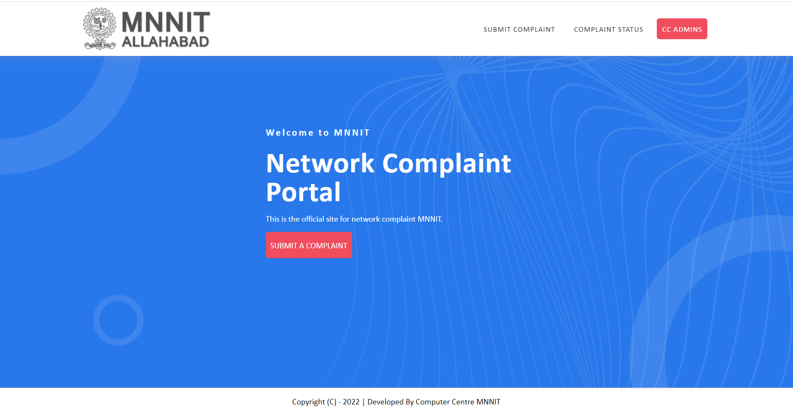
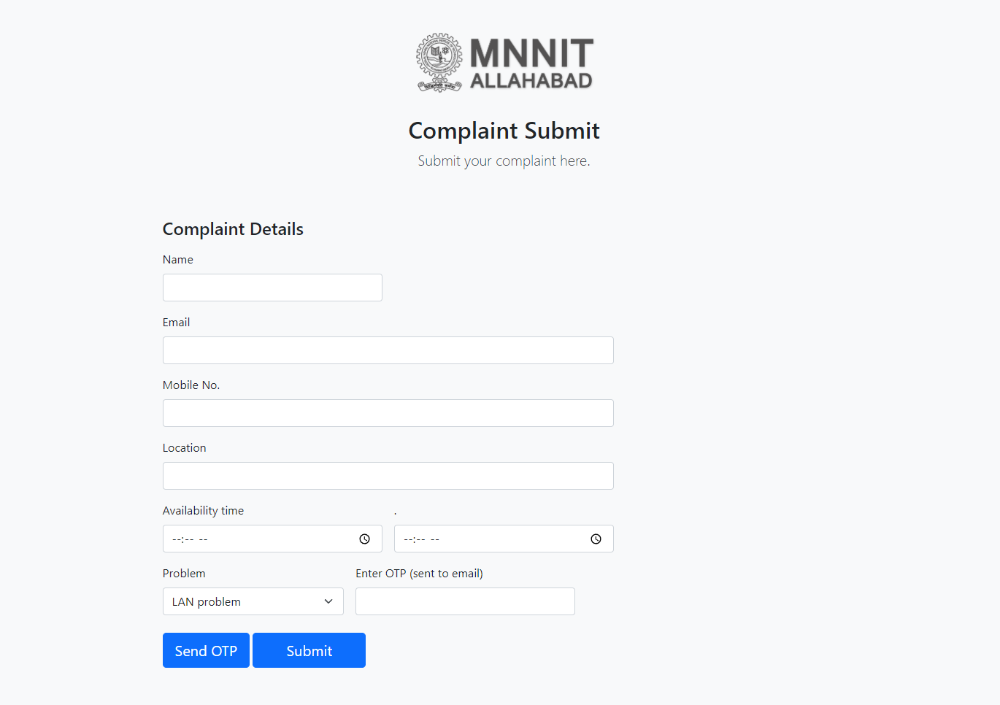
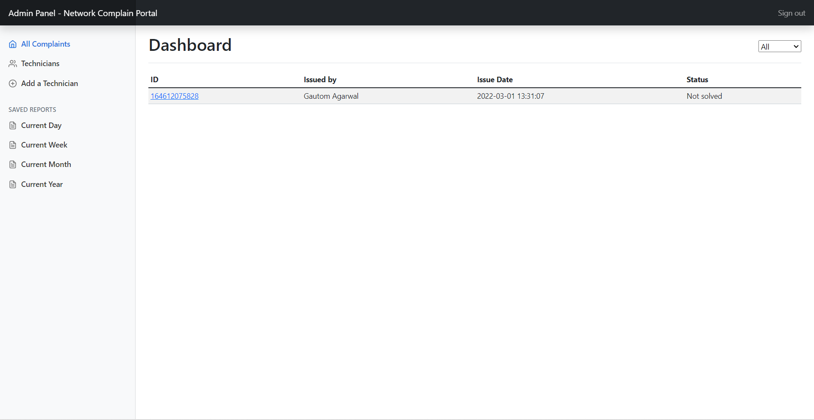
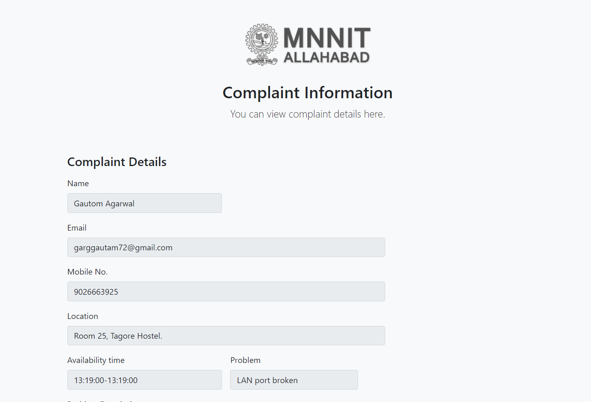
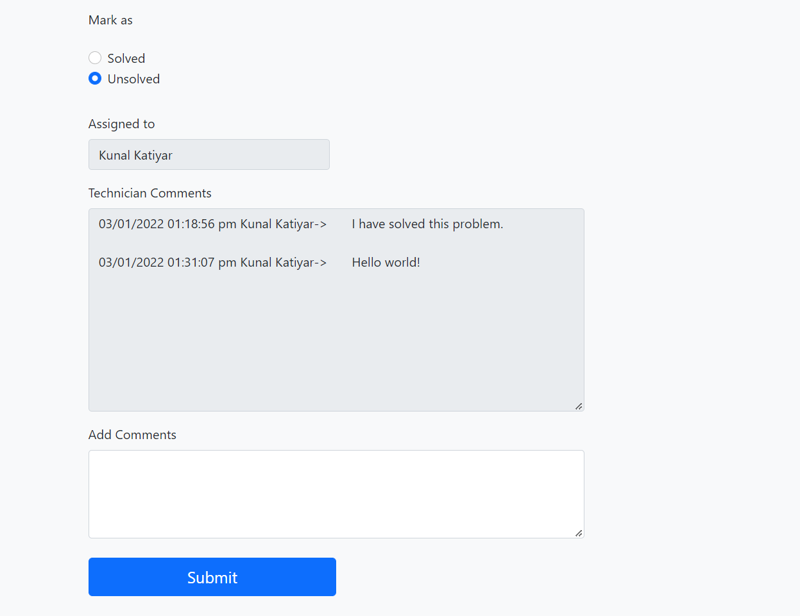

<h2 align="center"> <b>Network Complaint Portal</b> </h2>
This is a website for college students and faculties to report network issues they might be facing.
  

### Features - 

1. User can submit a complaint. For this an OTP will be sent to his email Address.
2. After the successful submission of the complain, User will be sent the Ticket number in his email for future reference.
3. Users can view the complaint status using the ticket number.
4. Admin can view all complaints in the admin portal and assign issues to Available Technincians.
5. Admin can also register a new Technician.
6. A Technician can view the issues assigned to him in the Technician Dashboard.
7. Admin and Technician can add a complaint solved/unsolved and add suitable remarks for the same.
8. Whenever a complaint is closed from the technician or admin end, user receives a mail that his issue has been resolved.

### Tech Stack - 
- HTML/CSS/JS
- Bootstrap
- PHP
- MYSQL

### To try hands on the project -  
1. Clone the project using link: https://github.com/gautom5987/ncp.git
2. Extract project files in C:\xampp\htdocs.
3. Open XAMPP Control panal and start <b>APACHE</b> and <b>MYSQL</b>.
4. Run on any browser.

Note - You can change Admin and SMTP details from the <b>credentials.php</b> file.
 

<h3 align="center"> <b>Screenshots</b> </h3>

#### Home page

 

#### Complaint Submit form

 

#### Admin Panel

 

#### Complaint Details from Admin side

 

 
